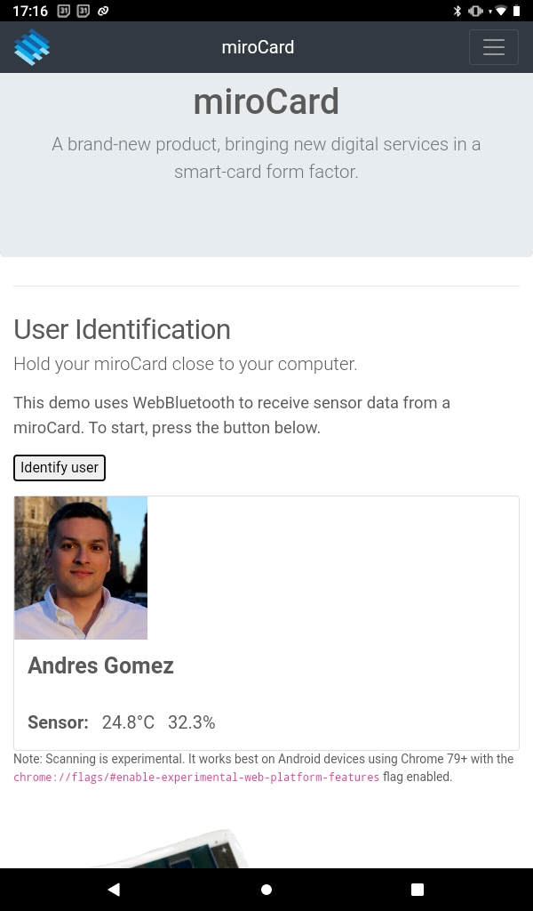

# miromico-website

This repo holds the html code and media for the one-page miroCard webbluetooth demo website.

Using standard BLE advertisement beacons, the data can be parsed and used to identify a user. The miroCard's sensor reading can also be visualized.

