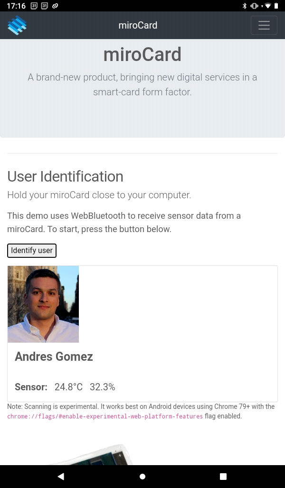

# mirocard-webid

HTML and JavaScript for a one-page MiroCard [Web Bluetooth](https://webbluetoothcg.github.io/web-bluetooth/)
demo. It listens to standard BLE advertisement beacons (`navigator.bluetooth.requestLEScan`),
uses them to identify a user, and visualizes the MiroCard's sensor readings.



## Usage

Serve the folder over HTTPS (or `localhost`) and open `index.html` in a browser that
supports BLE scanning. `requestLEScan` is still experimental; in Chrome it requires
`chrome://flags/#enable-experimental-web-platform-features`.

```
$ python3 -m http.server 8000   # then open http://localhost:8000
```

## Third-party components

* [Bootstrap](https://getbootstrap.com/) 4.5.2 in `assets/` (MIT, (c) The Bootstrap Authors, Twitter, Inc.),
  including Popper.js (MIT, (c) Federico Zivolo) in `bootstrap.bundle*.js`; page layout based on the
  Bootstrap carousel example.
* `carousel.css` contains code from [Start Bootstrap](https://startbootstrap.com/) (MIT, (c) Start Bootstrap).
* jQuery 3.5.1 (MIT) and the Altium web viewer embed script are loaded from their CDNs at runtime.

## MiroCard project

The MiroCard is a batteryless, light-powered BLE smart card, designed by Andres Gomez
(Miromico AG) and inspired by the
[Transient BLE Node](https://gitlab.ethz.ch/tec/public/employees/sigristl/transient_ble_node)
project developed at ETH Zurich. It was presented in:

> Andres Gomez. 2020. *Demo Abstract: On-Demand Communication with the Batteryless MiroCard.*
> In The 18th ACM Conference on Embedded Networked Sensor Systems (SenSys '20).
> [doi:10.1145/3384419.3430440](https://doi.org/10.1145/3384419.3430440)

Related repositories:

| Repository | Contents |
| --- | --- |
| [mirocard-hardware](https://github.com/ansgomez/mirocard-hardware) | Hardware: datasheet, schematics and Altium PCB project (MiroCard V2.0) |
| [mirocard-contiki-ng](https://github.com/ansgomez/mirocard-contiki-ng) | Firmware: Contiki-NG fork with the MiroCard platform and example applications |
| [miroreader-app](https://github.com/ansgomez/miroreader-app) | Android app to receive and display MiroCard beacons |
| [mirocard-scanner-python](https://github.com/ansgomez/mirocard-scanner-python) | Python (bluepy) script that scans for and decodes MiroCard beacons |
| [mirocard-discovery-python](https://github.com/ansgomez/mirocard-discovery-python) | Python (gattlib) script that discovers MiroCard BLE devices |
| [mirocard-scanner-mqtt](https://github.com/ansgomez/mirocard-scanner-mqtt) | Node.js bridge forwarding MiroCard beacons to an MQTT broker |
| [mirocard-scanner-influx](https://github.com/ansgomez/mirocard-scanner-influx) | Node.js bridge storing MiroCard beacons in InfluxDB |
| **mirocard-webid** (this repository) | Web Bluetooth demo page for identification and sensor readout |
| [mirocard-postprocessing](https://github.com/ansgomez/mirocard-postprocessing) | Jupyter notebook to post-process RocketLogger power measurements |
| [mirocard-plotly](https://github.com/ansgomez/mirocard-plotly) | Plotly Dash web app visualizing a RocketLogger measurement |

## License

This repository does not include a license file yet, so no reuse rights are granted.
TODO (Andres): confirm who owns this code (Andres Gomez and/or Miromico AG) and add a `LICENSE` file.
